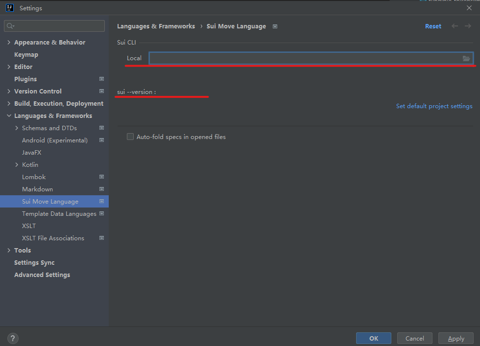
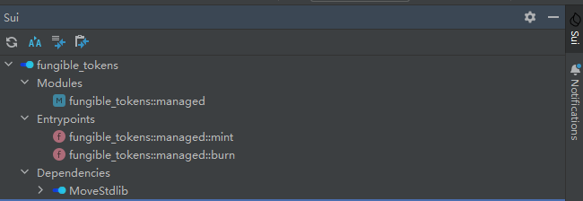

# Sui Move 语言 IntelliJ 平台插件

## 安装

在你的 IDE 中打开 `Settings > Plugins > Marketplace`，搜索 Sui Move Language 并安装该插件。

## 特性

语法高亮
代码格式化
跳转到定义
类型推断
Move.toml 和 move 二进制集成

## 依赖

对于 Move.toml 文件中指定的 git 依赖，你需要手动运行 move package build 来填充 build/ 目录。

## 兼容的 IDE

从 2022.3 版本开始的所有基于 IntelliJ 的 IDE。对于 2023.3 及以下版本，你可以使用插件的旧版本。

## 使用方法

### 设置 Sui Cli 路径

打开 `Settings > Languages&Frameworks > Sui Move Language`，点击文件选择并选择有效的 sui cli 路径。
然后版本标签将显示 sui cli 的版本。

### 使用 ToolWindow

该插件提供了一个专用的 ToolWindow，具有以下功能：

- 刷新项目:

   ： 同步项目的最新状态。

- 获取当前活跃地址:

  ： 显示当前活跃地址信息。

- 切换账户:

  ： 在不同账户间切换。

- 切换网络:

  ： 允许在不同网络环境之间切换，例如从开发网络切换到测试网络。

## 注意事项

在使用插件功能前，请确保项目正确设置。
插件的功能取决于项目的当前状态，请保持项目的更新。

## 获取帮助

在使用插件过程中遇到任何问题，请在 [GitHub](http://github.com/moveFuns/intellij-move) 上提出问题。